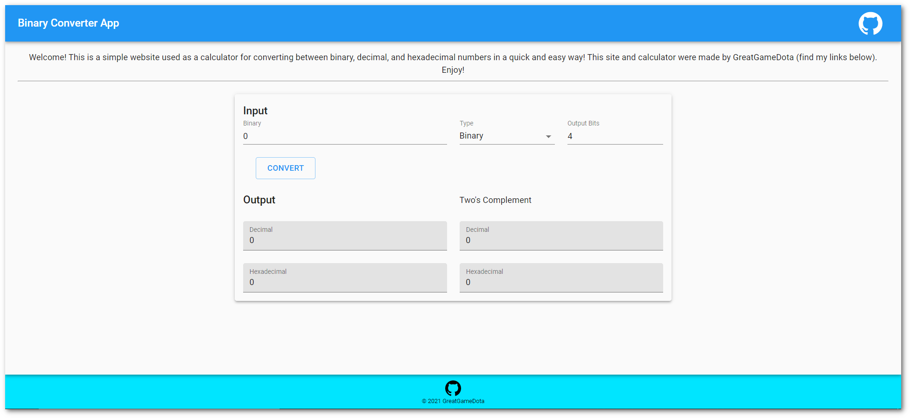

# Binary Converter App

Simple website to convert between bases of numbers. Supports binary, decimal, and hexadecimal numbers as well as two's complement. The calculator can convert from any of the supported numbers and represent the given input in every base except the input's base. There is also an option to adjust how many bits long the outputs should be.
